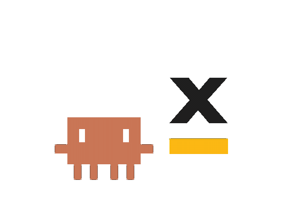

# FlowX Design System — Claude Skill

<p align="center">
  <picture>
    <source media="(prefers-color-scheme: dark)" srcset="assets/claude-x-flowx-highfive-dark.gif">
    
  </picture>
</p>

A [Claude](https://claude.com/claude-code) skill that teaches Claude the FlowX Design System, so any UI it builds or reviews for you matches FlowX's real colors, typography, spacing, components, and patterns — instead of generic AI defaults.

Install it once, then just mention "FlowX" in your request. Claude reads the authoritative token and component specs bundled here before it writes a single line of styling.

## What it's good for

- **Building prototypes that are on-brand from the first draft.** Ask Claude to build a settings page, a form, a dashboard "using the FlowX design system" and it uses the correct brand blue (`#006bd8`), Open Sans, the real button/input/card specs, and the right page structure — no guessing, no rounding, no Material/Bootstrap leftovers.
- **Auditing pages you've already built.** Point Claude at a prototype and ask "does this follow the FlowX design system?" It inventories every color, font, radius, and spacing value, compares them against the specs, and reports what's off — a wrong hex, a foreign font, an off-scale padding — with the correct value and where it comes from.
- **A single source of truth.** The specs are exported straight from the FlowX design system website, in both human-readable Markdown and machine-readable JSON.

## Install

Clone (or copy) this repo into your Claude skills directory as `flowx-design-system`:

```bash
git clone https://github.com/bogdandraghici/FLX-Design-System-Skill.git \
  ~/.claude/skills/flowx-design-system
```

That's it. Claude Code auto-discovers skills in `~/.claude/skills/`. The skill activates on its own whenever your request mentions FlowX; nothing else to configure.

To update later, `git pull` in that folder.

## How to use it

Just talk to Claude normally and reference FlowX. The skill has two modes it picks automatically:

**Build mode** — when you ask it to make or style something:
> "Build a workspace settings page **using the FlowX design system**."
> "Style this form **with FlowX components and tokens**."
> "Add a confirmation modal that follows **FlowX**."

Claude reads the relevant specs, then produces the UI with exact tokens: the grey app background, Primary/Secondary cards for structure, the typography hierarchy for headings, real component specs for buttons and inputs, and light-mode values by default. It works in whatever stack you're in (plain HTML/CSS, React, etc.) and won't invent values.

**Audit mode** — when you ask it to check existing work:
> "Check that these pages follow the **FlowX design system**."
> "Review this prototype against **FlowX** and tell me what's off."

Claude scans your source and returns findings grouped by severity — **Violations** (contradicts a spec: wrong color, foreign font/icons, missing required styles), **Off-system** values (no token equivalent, with the nearest suggested), and **Compliant-but-fragile** spots (right value, but hardcoded where a `--flowx-*` variable exists). It reports only; it fixes when you ask.

## What's inside

```
SKILL.md           Entry point — rules, build workflow, audit workflow, index
references/
  foundations/     Design tokens (the raw scales)
    colors         6 palettes (blue, yellow, green, orange, red, neutrals) + semantic tokens + dark mode
    typography     Font families, sizes, weights, line heights, text presets
    spacing        20-step spacing scale (0–160px)
    elevation      5 shadow levels (xs–xl)
    radius         11-step border radius scale (2–120px)
    opacity        13-step opacity scale (0–90%)

  components/      Component specs (every state, size, and color)
    button         3 scopes (Brand, Danger, Success) × 3 variants × 4 states × 4 sizes
    checkbox       Selected/unselected/indeterminate × states (incl. hover) × 2 sizes
    radio          Selected/unselected × states (incl. hover, error, disabled) × 2 sizes
    input-field    5 states × 2 sizes, with prefix/suffix/icon slots
    select-field   4 states × 2 sizes, chip or text fill modes
    switch         On/off × 2 states × 2 sizes
    segmented-button  2 states × 2 sizes, 2–5 mutually exclusive segments
    tabs           Active/inactive × 2 sizes, with optional icon and counter
    dropdown-panel Multi-select/single × 2 sizes, search + nesting (site name: Tree)
    values-table   Tables: read-only/editing/error/warning, batch edit, bordered variant

  patterns/        Page-level patterns (how to compose a screen)
    cards          Primary and Secondary cards, full-bleed table mode
    modals         4 widths, anatomy, button placement, multi-step
    typography-hierarchy  Text roles and section composition rules

  sync-state.json  Records which design-system-site commit these specs reflect
```

Each spec is a pair: a `.json` file (authoritative exact values Claude reads) and a `.md` twin (the same thing in plain English for people).

## Conventions

- Colors follow the FlowX token scale (e.g. blue-500 = `#006bd8`); CSS variables use the `--flowx-` prefix.
- Type is Open Sans (primary) and JetBrains Mono (monospace); icons are Phosphor Icons.
- Light mode is the default; dark/inverted values are included where the system defines them.

## Staying current

These files are a snapshot of the FlowX design system website, taken at the commit recorded in `references/sync-state.json` (last synced **2026-07-08**). When the design system changes, the specs are re-synced from the site and this repo is updated — `git pull` to get the latest.
